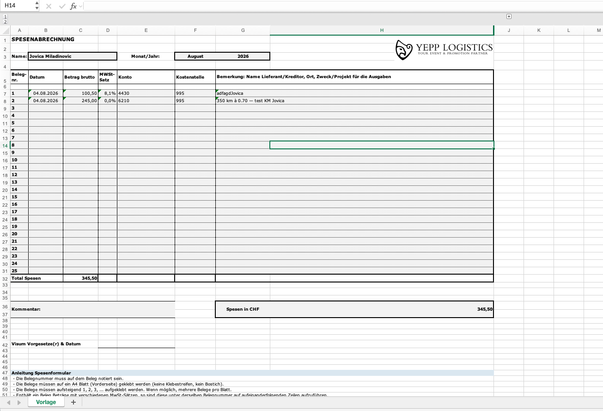

# Excel šablon

`.xlsm` na SharePointu, list `Vorlage`. Šablon se ne prepravlja: podaci
ulaze u skriveni list `Daten`, a šablon ih dohvata formulom.



```
Apps Script ─CSV─▶ Power Query (tabela Belege, list Daten) ─FILTER─▶ Vorlage B7:H31 i K7:K31
klik na J ─▶ foto.html (GitHub Pages) ─fetch─▶ Apps Script ─▶ download u Downloads
```

---

## 1. Power Query

1. **Daten → Daten abrufen → Aus anderen Quellen → Aus dem Web**

   ```
   <Web-App-URL>?token=<TOKEN_READ>&format=csv
   ```

   Autentifikacija: **Anonym**

2. **Erste Zeile als Überschriften verwenden**
3. Zadrži kolone `Datum`, `Brutto`, `MwstSatz`, `KontoNr`, `KstNr`,
   `Bemerkung`, `Mitarbeiter`, `Monat`, `Jahr` i **`BildLink`**
4. Tipovi: `Datum` → Datum, novčane → Dezimalzahl, `Monat`/`Jahr` → Ganze Zahl,
   `BildLink` → Text
5. Upit preimenuj u **`Belege`**. Naziv upita postaje naziv tabele,
   a formule u šablonu referišu `Belege[…]`.
6. **Schließen und laden in… → Tabelle → Neues Arbeitsblatt**,
   list nazovi `Daten` i sakrij ga

Filtriranje storniranih i deljenje `MwstSatz` sa 100 **ne rade se ovde**,
jer ih Apps Script već isporučuje gotove.

## 2. Automatsko osvežavanje na Macu

Excel za Mac nema *Aktualisieren beim Öffnen der Datei* za Power Query,
ali VBA radi. Sačuvaj kao **.xlsm** i u `DieseArbeitsmappe`:

```vba
Private Sub Workbook_Open()
    On Error Resume Next
    ThisWorkbook.RefreshAll
End Sub
```

`On Error Resume Next` je namerno: bez mreže makro tiho stane
umesto da izbaci dijalog s greškom.

## 3. Formule u šablonu

Pomoćni list `Hilfe` sa nazivima meseci u `A1:A12`, ćelija `$Z$1` sa
`VERGLEICH`, i u `B7`:

```
=SORTIEREN(FILTER(HSTAPELN(Belege[[Datum]:[KstNr]];Belege[KM];Belege[Bemerkung]);(Belege[Mitarbeiter]=$B$3)*(Belege[Monat]=$Z$1)*(Belege[Jahr]=$G$3);"");1)
```

Formula se prosipa u `B:H`: Datum, Betrag, MWSt, Konto, Kostenstelle, **KM**,
Bemerkung. Sortira po datumu (kolona 1).

Spojene ćelije u području u koje se formula prosipa obaraju je
greškom `#ÜBERLAUF!`. Odspoji ih pre svega ostalog.

### Kolona KM (između Kostenstelle i Bemerkung)

U koloni **G** stoji broj pređenih kilometara za vožnje, a u redu Total
njihov zbir. Kod običnih belega polje ostaje prazno. Postavljanje, jednom:

1. Desni klik na zaglavlje kolone **G** → **Zellen einfügen**. Bemerkung prelazi
   u `H`, kolona Foto u `K`, pomoćne ćelije u `Z1` i `AA`. Excel sam
   prilagođava sve formule.
2. **Godina u zaglavlju** je prešla iz `G3` u `H3`. Izaberi `H3`, **⌘X**, klikni
   `G3`, **⌘V**. Isečeno i nalepljeno, formule je prate. Polje Monat/Jahr je
   opet `F3:G3`.
3. U `G5` upiši `KM`.
4. U `B7` u formuli zameni samo `Belege[[Datum]:[Bemerkung]]` sa
   `HSTAPELN(Belege[[Datum]:[KstNr]];Belege[KM];Belege[Bemerkung])`.
   Ostatak formule ne diraj, jer ga je Excel već prilagodio. Rezultat izgleda
   kao formula gore.
5. `G7:G32` → **Zellen formatieren → Benutzerdefiniert** → `Standard;-Standard;;@`.
   Kod belega bez kilometara formula vraća `0`, a ovaj format nulu ne prikazuje.
6. U `G32` (red Total) upiši `=SUMME(G7:G31)`.

---

## 4. Kolona Foto

U koloni **K**, desno od tabele, svaki red sa fotografijom dobija link
**Herunterladen**. Klik otvara browser, a fotografija se odmah snima u
Downloads kao `Jovica Miladinovic 2026-08-04_100.50_R1123.jpg`. Ista stranica
je i prikazuje, uz dugme za ponovni pokušaj.

Nema makroa i ništa se ne instalira. Radi na Macu i Windowsu, za ljude bez
Google naloga i u browseru koji je prijavljen na više Google naloga.

### Kako radi

- **CSV sadrži kolonu `BildLink`.** Apps Script je računa pri svakom
  osvežavanju, ne stoji u tabeli. Link vodi na `foto.html` pored aplikacije
  (GitHub Pages), a ta stranica fotografiju preuzima od Apps Scripta.
- **Zašto ne direktno Apps Script stranica:** ako je browser prijavljen na
  više Google naloga, Google ubaci `/u/N/` u adresu i prikaže *Datei kann
  derzeit nicht geöffnet werden*. `foto.html` zahtev šalje bez Google
  kolačića, kao i aplikacija, pa je to ne pogađa.
- **Link je potpisan.** Otvara samo tu jednu fotografiju i ne sadrži
  `TOKEN_READ`. Ključ za potpis Apps Script sam napravi u Script Properties
  (`FOTO_SCHLUESSEL`). Ako ga obrišeš, svi stari linkovi prestaju da važe, a
  Excel posle sledećeg osvežavanja ima nove.
- **Formula filtrira i sortira isto kao `B7`**, samo uzima `BildLink`. Zato
  red 7 dobija link prvog belega, red 8 drugog, i tako dalje (`ZEILE()-6`).
  Ako ikad menjaš uslove u `B7`, promeni ih i ovde.
- **Svaka ćelija ima svoju formulu**, umesto jedne koja se prosipa, i
  `HYPERLINK` je spolja, ne u `LET`. Samo tako je link sigurno klikabilan.
- **Greška namerno nije sakrivena.** Ako `BildLink` fali u tabeli, ćelija
  pokazuje `#BEZUG!` umesto da tiho ostane prazna.

### Postavljanje, jednom za fajl

1. **`BildLink` u Power Query.** Prvo objavi novi `Code.gs` kao novu verziju.
   Zatim **Daten → Daten abrufen → Power Query-Editor starten**, upit `Belege`,
   **Aktualisieren → Vorschau aktualisieren**. Dole treba da piše
   *Spalten: 13*, a poslednja kolona je `BildLink`.
   - Ako upit ima samo korake *Quelle → Kopf → Typen*, ne menjaj ništa.
     Nova kolona ulazi sama.
   - Ako formula u koraku *Quelle* sadrži `Columns=12`, promeni u `Columns=13`.
     Inače Power Query tiho odseca 13. kolonu.
   - Ako postoji korak *Andere entfernte Spalten*, dodaj `"BildLink"` na kraj
     liste.
   - **Schließen & laden.**
2. **Pomoćna kolona `AA`** (pored ćelije `Z1`) računa URL za svaki red.
   U `AA7` upiši formulu ispod i kopiraj je do `AA31`:

   ```
   =LET(z;(Belege[Mitarbeiter]=$B$3)*(Belege[Monat]=$Z$1)*(Belege[Jahr]=$G$3);n;SUMME(z);i;ZEILE()-6;WENN(i>n;"";INDEX(SORTIEREN(FILTER(HSTAPELN(Belege[Datum];Belege[BildLink]);z);1);i;2)))
   ```

3. **Link.** U `K5` upiši `Foto`, u `K7` formulu ispod, i kopiraj je do `K31`:

   ```
   =WENN(LINKS(AA7;4)="http";HYPERLINK(AA7;"Herunterladen");"")
   ```

4. Proveri jedan klik, pa sakrij kolonu `AA` i sačuvaj.

**Zašto dve kolone:** sa `HYPERLINK` unutar `LET` Excel za Mac je
prikazao *Herunterladen*, ali klik nije radio ništa. Sa `HYPERLINK` spolja,
umotanim samo u `WENN`, klik radi (provereno na Excelu za Mac).
Pomoćna kolona usput pokazuje koji URL je formula našla, što pomaže kad
nešto ne radi.

Kolona `J` je sakrivena grupisanjem (pre kolone KM bila je `I`). Ne koristi je.

Ako je kolona Foto postavljena pre kolone KM (u `J`, sa pomoćnom `Z`), ništa ne
radiš: ubacivanje kolone `G` ih samo pomera u `K` i `AA`.

**U SharePoint folder:** fotografiju sa stranice prevuci mišem direktno u
sinhronizovani SharePoint folder u Finderu. Automatsko kopiranje u
SharePoint nije moguće bez registracije aplikacije u Microsoft 365 ili
Power Automate, jer SharePoint prima fajlove samo od prijavljenog
Microsoft naloga.

### Problemi

| Simptom | Uzrok |
|---|---|
| *Herunterladen* se vidi, a klik ne radi ništa | `HYPERLINK` je unutar `LET`; koristi dve kolone (`AA` i `K`) kao u koracima 2 i 3. Ako ni tada ne radi, kopiraj URL iz `AA` u browser: otvara li se fotografija? |
| `B7` pokazuje `#ÜBERLAUF!` posle ubacivanja kolone KM | nešto stoji u `G7:H31` (tekst ili spojene ćelije); obriši ili odspoji |
| Kilometri se vide, a zbir u `G32` je `0` | `KM` je u Power Query-ju tip *Text*; u koraku *Typen* postavi `KM` na *Dezimalzahl* |
| `K7` pokazuje `#BEZUG!` ili `#NAME?` | `BildLink` nije u tabeli `Belege` (korak 1), ili Excel nema `HSTAPELN` (potreban Microsoft 365) |
| Power Query pokazuje *Spalten: 12* | server još vraća stari kod: u Apps Scriptu **Neue Version**, pa *Vorschau aktualisieren* |
| Fotografija postoji u aplikaciji, a link nema | Excel nije osvežen (**Daten → Alle aktualisieren**) |
| Stranica kaže *Dieser Link ist ungültig* | ključ za potpis je promenjen; osveži Excel |
| Stranica stoji na *Foto wird geladen …* ili javlja *Keine Verbindung* | `API` u `foto.html` nije ista adresa kao `CONFIG.url` u `index.html` |
| Fotografija se prikaže, ali nema downloada | browser je blokirao automatski download; klikni **Herunterladen** na stranici |

---

## 5. SharePoint

**Fajl se ne otvara iz browsera.** Excel for Web ne osvežava Power Query,
ne pokreće `Workbook_Open` i to ne javlja. Sinhronizuj biblioteku i otvaraj
fajl iz Findera.
